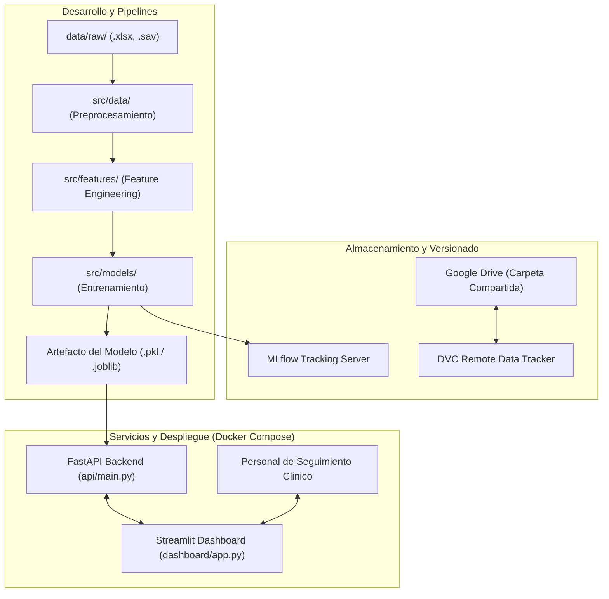
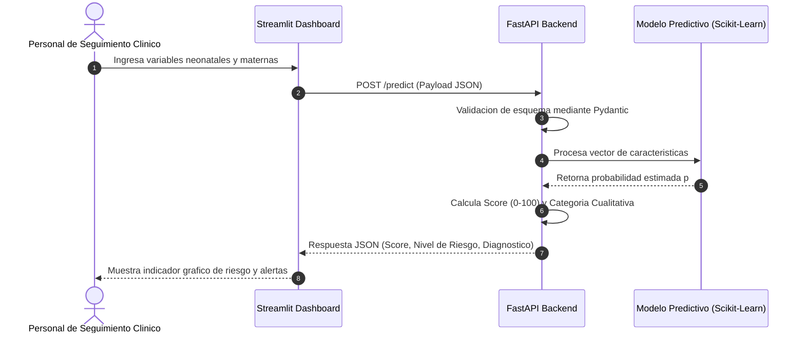

# NeuroRisk: Predicción Temprana de Alteraciones en el Neurodesarrollo de Neonatos Prematuros

Prototipo de solución analítica end-to-end de Machine Learning y arquitectura MLOps para la estimación del riesgo de alteración del neurodesarrollo en neonatos prematuros.

---

## 1. Definicion del Problema y Contexto de Negocio

### 1.1 Problema Principal
La prematurez y el bajo peso al nacer son factores de riesgo bien establecidos para alteraciones del neurodesarrollo a mediano y largo plazo, afectando los dominios cognitivo, de lenguaje, perceptual y motor (fino y grueso). A diferencia de complicaciones agudas que se resuelven durante la hospitalizacion, estas alteraciones se consolidan progresivamente durante los primeros anios de vida, lo cual abre una ventana real de intervencion temprana (estimulacion, seguimiento prioritario) si se logra identificar oportunamente que neonatos estan en mayor riesgo.

Este proyecto busca predecir, a partir de variables clinicas tempranas (maternas, del parto y de la hospitalizacion neonatal), si un neonato prematuro presentara alguna alteracion del neurodesarrollo, evaluada mediante las Escalas Bayley de Desarrollo Infantil en los dominios cognitivo, de lenguaje, perceptual, motor fino y motor grueso.

**Seleccion del problema basada en el EDA:** durante la exploracion inicial de datos se considero la sepsis neonatal como variable objetivo. Sin embargo, el analisis de distribucion mostro un desbalance severo (solo 5 de 89 casos positivos, 5.6%), insuficiente para entrenar y validar un modelo de clasificacion de forma confiable con un dataset de este tamanio. Las variables de alteracion del neurodesarrollo mostraron distribuciones considerablemente mas balanceadas (24.7% a 34.8% por dominio individual, 52.8% al considerar la variable compuesta), por lo cual se definio como variable objetivo del proyecto.

### 1.2 Pregunta de Negocio
¿Como estimar probabilisticamente el riesgo de que un neonato prematuro presente una alteracion del neurodesarrollo, a partir de sus condiciones de nacimiento y antecedentes maternos, con el fin de priorizar el seguimiento clinico y la intervencion temprana (estimulacion, referencia a especialistas) en los pacientes de mayor riesgo?

### 1.3 Alcance del Proyecto
El proyecto contempla el desarrollo de un prototipo funcional que abarca:
- Versionado de datos con DVC conectado a una carpeta compartida de Google Drive como almacenamiento remoto.
- Exploracion de datos (EDA) y preprocesamiento estructurado.
- Entrenamiento y versionado de modelos supervisados mediante MLflow.
- Despliegue de un microservicio API RESTful en FastAPI para servir inferencias.
- Desarrollo de una interfaz de usuario interactiva en Streamlit para el personal de seguimiento clinico y neurodesarrollo.
- Empaquetamiento y orquestacion con Docker y Docker Compose.

---

## 2. Conjunto de Datos

- **Nombre:** Dataset on neonatal and maternal factors influencing neurodevelopmental outcomes in preterm infants.
- **Origen:** Estudio de cohorte retrospectivo en el Hospital Ghaem (Mashhad, Iran), neonatos hospitalizados entre 2016 y 2020.
- **Tamanio:** 89 registros de neonatos prematuros, 53 variables.
- **Variables:** Antecedentes maternos (diabetes mellitus, preeclampsia, hipotiroidismo), condiciones neonatales (peso al nacer, edad gestacional, sexo, apgar), complicaciones hospitalarias, intervenciones clinicas y evaluaciones de neurodesarrollo mediante las Escalas Bayley (dominios cognitivo, de lenguaje, perceptual, motor fino y motor grueso).
- **Variable Objetivo (Target):** `neurodev_alteration`, variable compuesta binaria (`abnormal` si al menos uno de los cinco dominios evaluados resulta anormal, `normal` en caso contrario). El resto de variables, incluyendo `sepsis`, se emplean como predictores.
- **Fuentes:** [Mendeley Data](https://data.mendeley.com/datasets/h464gsf77t/2) | [Articulo cientifico asociado](https://www.sciencedirect.com/science/article/pii/S2352340924000325)

---

## 3. Arquitectura del Sistema

### 3.1 Diagrama de Arquitectura MLOps y Contenedores



### 3.2 Flujo de Datos para Inferencia Clinica



---

## 4. Guia de Instalacion y Configuraracion del Repositorio (Setup)

### 4.1 Prerrequisitos
- Python 3.12
- Gestor de paquetes `uv` (version >= 0.1.0)
- Git y DVC
- Docker y Docker Compose (opcional para entorno local, requerido para despliegue)

### 4.2 Instalacion y Gestion del Entorno con uv

El proyecto utiliza `uv` como gestor de paquetes y entornos de alto rendimiento con Python 3.12:

1. Clonar el repositorio y posicionarse en la rama de trabajo:
```bash
git clone https://github.com/MAIA-FinalProject/Microproyecto.git
cd Microproyecto
git checkout chore/semana3
```

2. Crear e inicializar el entorno virtual con `uv`:
```bash
uv venv .venv --python 3.12
```

3. Instalar las dependencias del proyecto y el grupo de desarrollo:
```bash
uv pip install -e .[dev]
```

4. Instalar los hooks de `pre-commit`:
```bash
uv run pre-commit install
```

### 4.3 Orquestacion de Tareas con PoeThePoet (Task Runner)

El proyecto incluye tareas automatizadas configuradas en `pyproject.toml` para estandarizar el flujo de trabajo del equipo:

- **Verificacion completa de calidad de codigo (Ruff Linter + Ruff Formatter + Mypy Types):**
  ```bash
  uv run poe check
  ```
- **Ejecutar suite de pruebas unitarias con cobertura:**
  ```bash
  uv run poe test
  ```
- **Formatear y corregir estilo de codigo con Ruff:**
  ```bash
  uv run poe format
  ```
- **Corregir automaticamente errores de linting:**
  ```bash
  uv run poe lint-fix
  ```
- **Iniciar servidor backend de desarrollo (FastAPI):**
  ```bash
  uv run poe dev-api
  ```
- **Iniciar interfaz de usuario de desarrollo (Streamlit):**
  ```bash
  uv run poe dev-dashboard
  ```

### 4.4 Variables de Entorno

Copiar el archivo de plantilla `.env.example` a `.env` y configurar las credenciales de MLflow:
```bash
cp .env.example .env
```

El remoto de datos usa Google Drive vía DVC con autenticacion OAuth individual.
La primera vez que se corra `dvc pull` o `dvc push`, se abrira el navegador
para iniciar sesion con la cuenta de Google invitada a la carpeta compartida
del proyecto (debe estar previamente agregada como usuario de prueba en la
app de Google Cloud del proyecto).

Antes de eso, cada persona debe configurar **una sola vez por maquina** el
client secret del proyecto (no viaja en el repositorio ni en `.env`, se
comparte por un canal privado del equipo):
```bash
dvc remote modify --local gdrive_remote gdrive_client_secret "<VALOR_COMPARTIDO_POR_EL_EQUIPO>"
```
Esto queda guardado en `.dvc/config.local` (ignorado por git). Sin este paso,
la autenticacion con Drive entra en loop sin completarse.

---

## 5. Diseño del Prototipo y Mockup del Tablero (UI/UX)

La interfaz grafica esta diseñada orientada a priorizar el seguimiento clinico y la intervencion temprana en neonatos prematuros. Se divide en dos modulos funcionales principal y secundario:

```
+-----------------------------------------------------------------------------------+
| NEURORISK - TABLERO DE RIESGO DE ALTERACION DEL NEURODESARROLLO                  |
+---------------------------------------------------+-------------------------------+
| BARRA LATERAL (CONFIGURACION Y PACIENTE)         | PANEL PRINCIPAL               |
|                                                   |                               |
| [Conexion API Backend]                            | TAB 1: EVALUACION PREDICTIVA  |
| URL: http://localhost:8000                        | ----------------------------- |
| Estado: Conectado (API v0.1.0)                    |                               |
|                                                   | [PUNTAJE DE RIESGO]            |
| [Datos Maternos]                                  |  +-------------------------+  |
| - Edad Materna: [ 28 ]                            |  |   PUNTAJE: 68 / 100     |  |
| - Diabetes Mellitus: ( ) Si  (X) No               |  |   CATEGORIA: RIESGO ALTO |  |
| - Preeclampsia:      (X) Si  ( ) No               |  +-------------------------+  |
| - Hipotiroidismo:    ( ) Si  (X) No               |                               |
|                                                   | Probabilidad Estimada: 68.2%  |
| [Datos Neonatales]                                |                               |
| - Peso al nacer (g): [ 1250 ]                     | [Recomendacion Clinica]       |
| - Edad Gestacional (semanas): [ 30 ]              | Priorizar cita con especialis-|
| - Tipo de parto: [ Cesarea      v ]               | ta en neurodesarrollo e inici-|
| - Apgar minuto 1: [ 6 ]                           | ar estimulacion temprana.     |
| - Sexo: [ Masculino v ]                           |                               |
|                                                   | ----------------------------- |
| [ BOTON: CALCULAR RIESGO ]                        | TAB 2: EXPLORACION POBLACIONAL|
|                                                   | - Grafico Peso vs Alteracion  |
|                                                   | - Distribucion por Edad Gest. |
+---------------------------------------------------+-------------------------------+
```

### Elementos y Relacion con la Pregunta de Negocio:
1. **Ingreso Clinico Agil:** Permite ingresar los antecedentes maternos y neonatales en menos de 1 minuto durante la consulta de seguimiento.
2. **Puntaje Estandarizado (0 - 100):** Transforma la probabilidad matematica continua en una escala facil de interpretar por el personal de seguimiento.
3. **Clasificacion Cualitativa por Rangos de Riesgo:**
   - **Bajo (0 - 25):** Seguimiento estandar del programa.
   - **Moderado (26 - 50):** Seguimiento mas frecuente, atencion a senales de alarma.
   - **Alto (51 - 75):** Priorizar cita con especialista en neurodesarrollo, iniciar estimulacion temprana.
   - **Critico (76 - 100):** Referencia inmediata a evaluacion multidisciplinaria y plan de intervencion temprana intensivo.
4. **Modulo Descriptivo DataViz:** Proporciona contexto historico de la cohorte para analizar patrones de alteracion del neurodesarrollo segun edad gestacional y peso al nacer.

---

## 6. Estructura del Repositorio

```
.
├── .github/
│   └── workflows/              # Workflows de CI/CD para GitHub Actions
├── data/
│   ├── raw/                    # Datos crudos (.xlsx, .sav, codebook .pdf - Trackeado por DVC)
│   ├── processed/              # Datos limpios y transformados
│   └── features/               # Matriz de caracteristicas para modelado
├── notebooks/                  # Notebooks Jupyter para EDA y experimentacion
├── src/                        # Codigo fuente modular de Python
│   ├── __init__.py
│   ├── config.py               # Configuración centralizada (Pydantic Settings)
│   ├── data/                   # Modulos de carga y limpieza de datos
│   ├── features/               # Modulos de ingenieria de caracteristicas
│   └── models/                 # Modulos de entrenamiento, evaluacion e inferencia
├── api/                        # Microservicio Backend (FastAPI)
│   ├── __init__.py
│   ├── main.py                 # Puntos de entrada REST API y validacion Pydantic
│   └── Dockerfile              # Imagen Docker del Backend
├── dashboard/                  # Interfaz de Usuario Frontend (Streamlit)
│   ├── app.py                  # Aplicacion principal del tablero
│   └── Dockerfile              # Imagen Docker del Dashboard
├── tests/                      # Suite de pruebas unitarias y de integracion
│   ├── __init__.py
│   └── test_api.py
├── deploy/                     # Orquestacion de contenedores
│   └── docker-compose.yml
├── .env.example                # Plantilla de variables de entorno
├── .gitignore                  # Reglas de exclusion de Git
├── .pre-commit-config.yaml     # Hooks automatizados de calidad de codigo
└── pyproject.toml              # Configuracion de dependencias, Ruff, Mypy y Poe tasks
```

---

## 7. Plan de Trabajo en Equipo y Responsabilidades

| Bloque de Trabajo | Tarea en Repositorio | Entregable Documental |
| :--- | :--- | :--- |
| **1 - Setup** | Estructura base del repo (Git, README, carpetas, .gitignore, uv, pyproject.toml) | Seccion "Problema y Contexto" |
| **2 - Datos** | Configurar DVC, remoto Google Drive y versionamiento de datos | Seccion "Conjunto de Datos" |
| **3 - EDA General** | Carga de datos, analisis de nulos y distribuciones generales; identificacion del target compuesto | Seccion "Hallazgos del EDA (Parte 1)" |
| **4 - EDA Enfocado** | Correlaciones, verificacion de correctedage/Age, surfactant/aggressive.ventilation y pregnancycomplication | Seccion "Hallazgos del EDA (Parte 2)" |
| **5 - Prototipo** | Diseñar mockup del tablero y maquetas de la API FastAPI y Streamlit | Seccion "Maqueta y Alcance" |
| **Transversal** | Integracion continua, revision de codigo, formateo de reporte y consolidacion final | Reporte de Trabajo en Equipo |

---

## 8. Despliegue con Docker Compose

Para desplegar la solucion completa en contenedores aislados:

```bash
docker-compose -f deploy/docker-compose.yml up --build -d
```

Servicios expuestos:
- **FastAPI Backend:** `http://localhost:8000/docs`
- **Streamlit Dashboard:** `http://localhost:8501`